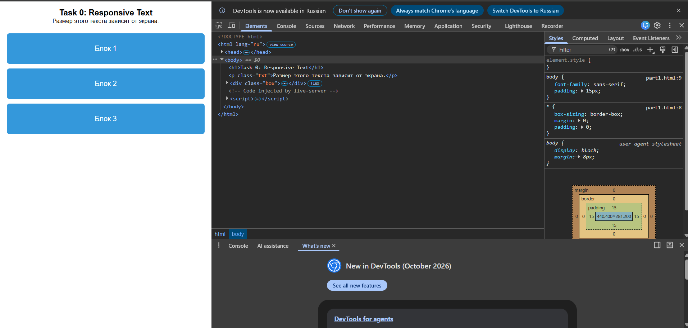
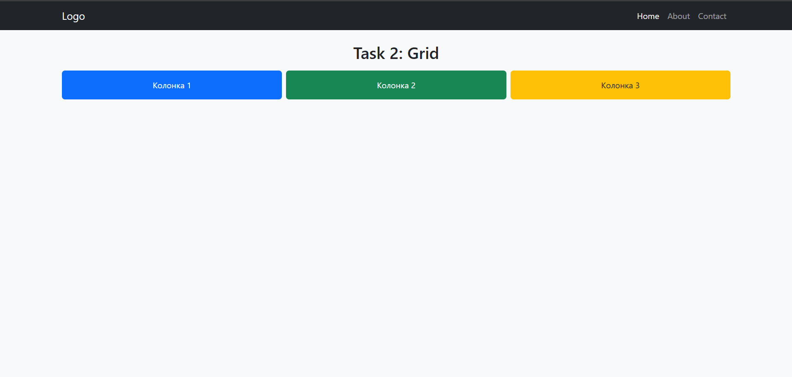
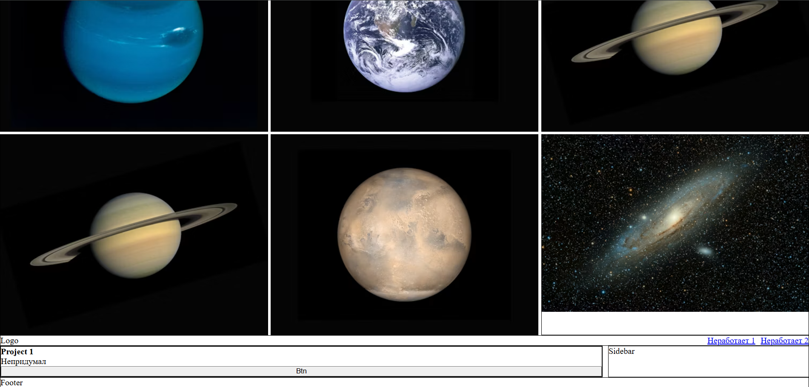

Assignment 2: Flexbox & Grid Systems

Student: Abbaskhan Ibraimov
Group ; IT-2501

Overview

This report describes the implementation of responsive and structured web layouts built with CSS Flexbox and CSS Grid System.

Task Breakdown

Part 1: Flexbox Layouts

Task 0 Navigation Bar:

Implemented a navigation bar using display flex.

Applied justify-content space-between to position the logo and navigation links on opposite sides of the header.

Vertically aligned all elements using align-items center.

Task 1 Card Row:

Built a row of 3 cards with consistent spacing using gap 15px.

Applied align-items stretch to ensure uniform height across all cards.

Configured a vertical flex layout inside each card using flex-direction column.

Applied flex-grow 1 to the description paragraph to push the action button to the bottom of the card.

Added a hover effect for interactive feedback.

Part 2: Grid System

Task 2 Page Layout with Grid Areas:

Created a structural page layout using display grid and grid-template-areas.

Divided the layout into 4 distinct regions: header, sidebar, main, and footer.

Set up column proportions using 1fr 3fr.

Task 3 Image Gallery:

Constructed a 3x3 gallery grid using grid-template-columns repeat(3, 1fr).

Implemented a text overlay that appears on hover using opacity 1.

Part 3: Combining Flexbox & Grid

Task 4 Portfolio Page:

Combined Flexbox and Grid techniques within a single layout:
Grid manages the outer layout structure (main content and sidebar split into 3fr 1fr).
Flexbox handles inner layout components: header navigation and content inside project cards.

Conclusion

Key concepts covered during this assignment include:

Differences between 1D Flexbox and 2D Grid layout systems.

Distributing free space using fractional units (fr) and flex-grow.

Setting up named layout areas using grid-template-areas.

